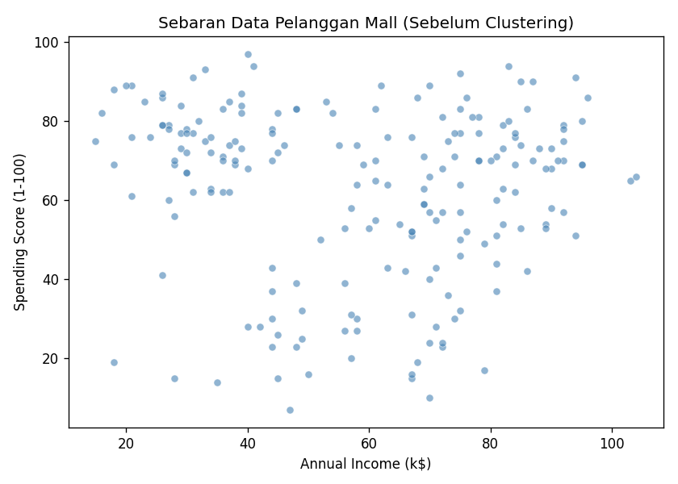
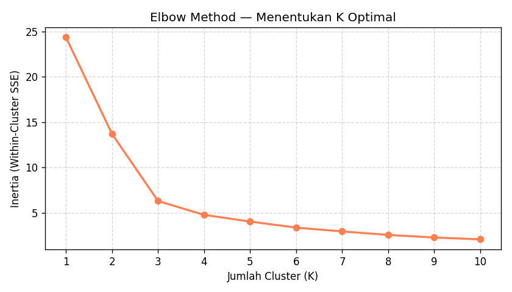
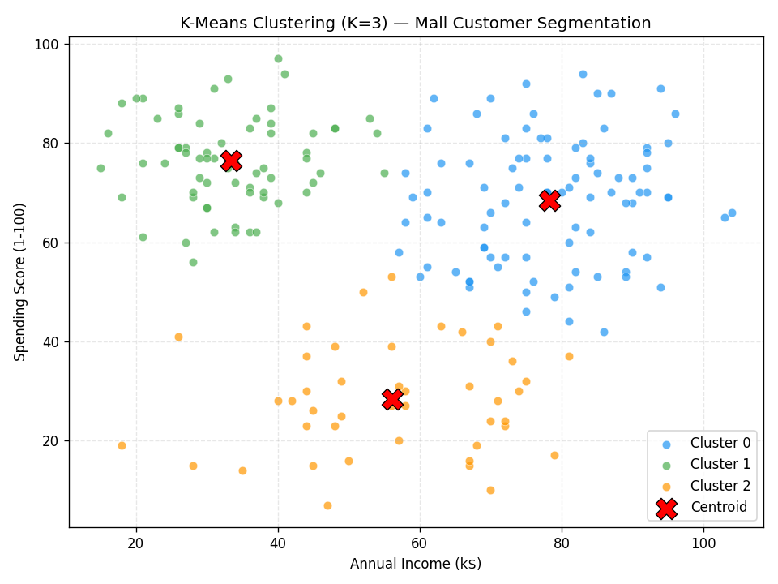
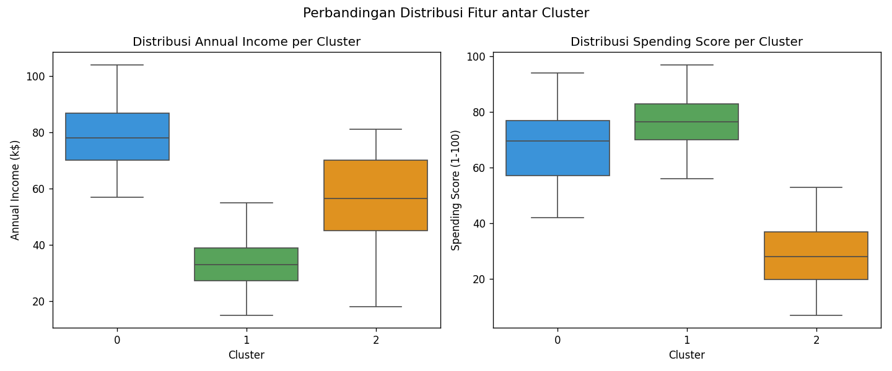

# 🛒 K-Means Clustering — Mall Customer Segmentation

> **Latihan Materi 11: K-Means Clustering**  
> Implementasi K-Means Clustering menggunakan Python pada dataset Mall Customer Segmentation.

---

## 📌 Deskripsi Proyek

Proyek ini merupakan latihan implementasi algoritma **K-Means Clustering** untuk melakukan segmentasi pelanggan mall berdasarkan:
- **Annual Income** (Pendapatan Tahunan)
- **Spending Score** (Skor Belanja)
- **Age** (Usia)

Tujuannya adalah mengelompokkan pelanggan ke dalam beberapa segmen agar bisnis dapat memahami karakteristik tiap kelompok pelanggan dan merancang strategi pemasaran yang lebih tepat sasaran.

---

## 📁 Struktur File

```
📦 kmeans-mall-customer/
├── 📄 kmeans_mall_customers.py     # Kode program utama
├── 🖼️ 01_sebaran_data_awal.png     # Visualisasi sebaran data sebelum clustering
├── 🖼️ 02_elbow_method.png          # Grafik Elbow Method (menentukan K optimal)
├── 🖼️ 03_hasil_clustering.png      # Hasil visualisasi cluster + centroid
├── 🖼️ 04_boxplot_cluster.png       # Distribusi fitur per cluster
└── 📄 README.md
```

---

## 🛠️ Library yang Digunakan

```python
import pandas as pd
import numpy as np
import matplotlib.pyplot as plt
import seaborn as sns
from sklearn.cluster import KMeans
from sklearn.preprocessing import MinMaxScaler
```

---

## 🔄 Alur Program

```
Load Dataset
     ↓
Eksplorasi Data (info, head, describe)
     ↓
Pilih Fitur (Annual Income & Spending Score)
     ↓
Normalisasi Data (MinMaxScaler)
     ↓
Elbow Method → Tentukan K Optimal
     ↓
Training Model KMeans (K=3)
     ↓
Visualisasi Hasil Clustering
     ↓
Analisis & Interpretasi Cluster
```

---

## 📊 Visualisasi

### 1. Sebaran Data Awal (Sebelum Clustering)

Scatter plot menampilkan distribusi seluruh data pelanggan berdasarkan **Annual Income** dan **Spending Score** sebelum dilakukan proses clustering.



---

### 2. Elbow Method — Menentukan K Optimal

Grafik Elbow Method digunakan untuk menentukan jumlah cluster (K) yang paling optimal. Titik "siku" (elbow) pada grafik menunjukkan nilai K yang ideal, yaitu saat penambahan K tidak lagi mengurangi inertia secara signifikan.

> 📌 Berdasarkan grafik, **K = 3** dipilih sebagai nilai optimal.



---

### 3. Hasil K-Means Clustering (K=3)

Visualisasi hasil clustering menampilkan 3 kelompok pelanggan yang terbentuk, beserta posisi **centroid** (tanda ✕ merah) dari masing-masing cluster.



---

### 4. Distribusi Fitur per Cluster (Boxplot)

Boxplot menampilkan perbandingan distribusi **Annual Income** dan **Spending Score** pada setiap cluster, sehingga memudahkan analisis karakteristik tiap kelompok.



---

## 📈 Hasil Analisis Cluster

| Cluster | Rata-rata Usia | Annual Income | Spending Score | Interpretasi |
|:-------:|:--------------:|:-------------:|:--------------:|:-------------|
| **0**   | 37.9 tahun     | 78.3 k$       | 68.4           | 💼 Dewasa, penghasilan tinggi, aktif belanja |
| **1**   | 24.7 tahun     | 33.4 k$       | 76.4           | 🧑 Muda, penghasilan rendah, aktif belanja |
| **2**   | 47.6 tahun     | 56.2 k$       | 28.4           | 🏠 Paruh baya, penghasilan menengah, hemat |

---

## 💡 Insight Bisnis

- **Cluster 0** — Pelanggan dengan daya beli tinggi dan aktif berbelanja. Cocok menjadi target utama program loyalitas dan promosi produk premium.
- **Cluster 1** — Pelanggan muda yang antusias berbelanja meski pendapatan rendah. Responsif terhadap diskon, flash sale, dan program cicilan.
- **Cluster 2** — Pelanggan yang cenderung hemat. Dapat didekati dengan penawaran produk kebutuhan sehari-hari dan promosi berbasis nilai (value-for-money).

---

## ▶️ Cara Menjalankan

1. Clone repository ini:
   ```bash
   git clone https://github.com/username/kmeans-mall-customer.git
   cd kmeans-mall-customer
   ```

2. Install dependensi:
   ```bash
   pip install pandas numpy matplotlib seaborn scikit-learn
   ```

3. Jalankan program:
   ```bash
   python kmeans_mall_customers.py
   ```

---

## 📚 Referensi

- [UCI Machine Learning Repository — GPS Trajectories](https://archive.ics.uci.edu/dataset/354/gps+trajectories)
- [Kaggle — Mall Customer Segmentation Dataset](https://www.kaggle.com/datasets/vjchoudhary7/customer-segmentation-tutorial-in-python)
- [Scikit-learn KMeans Documentation](https://scikit-learn.org/stable/modules/generated/sklearn.cluster.KMeans.html)

---

## 👤 Informasi

| | |
|---|---|
| **Mata Kuliah** | Machine Learning |
| **Materi** | 11 — K-Means Clustering |
| **Algoritma** | K-Means Clustering |
| **Dataset** | Mall Customer Segmentation |
| **Bahasa** | Python 3 |
